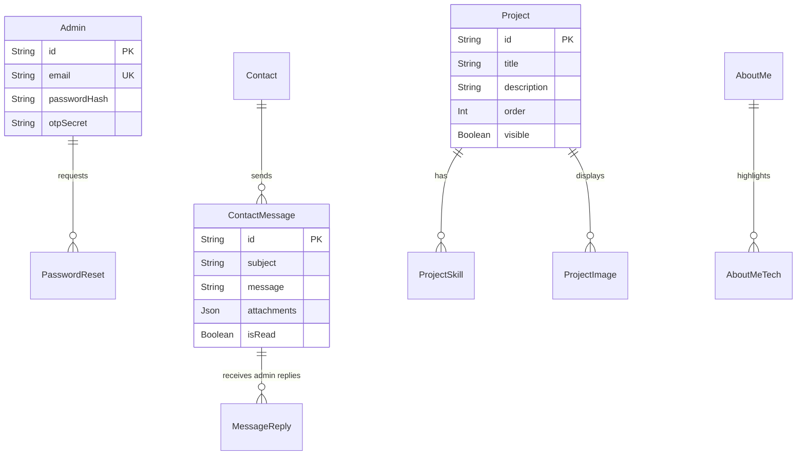

<div align="center">
  <h1>✨ Hëdi OKBA - Portfolio de Développeur Premium</h1>
  <p><strong>Une expérience web moderne et performante couplée à un CMS Headless hautement sécurisé</strong></p>
  
  <p>
    <a href="https://nextjs.org"></a>
    <a href="https://react.dev/"></a>
    <a href="https://www.typescriptlang.org"></a>
    <a href="https://tailwindcss.com"></a>
    <a href="https://www.framer.com/motion/"></a>
    <a href="https://www.prisma.io"></a>
  </p>

  <h3><a href="README.md"><u>📖 - English Version - </u></a></h3>
</div>

<br />

Bienvenue sur le code source de mon portfolio personnel. Ce dépôt est bien plus qu'une simple page de présentation : c'est une démonstration d'**ingénierie full-stack, d'optimisation des performances et de normes de sécurité rigoureuses**. Il intègre une interface publique élégante et un tableau de bord d'administration entièrement fonctionnel et hautement sécurisé.

---

## 🚀 Proposition de Valeur & Vision Technique

Lors de la création de cette plateforme, mon objectif était de démontrer une maîtrise sur l'ensemble de la stack web moderne. Cette application est structurée pour offrir :

1. **Une Expérience Utilisateur (UX) Sans Compromis :** Utilisation de micro-animations accélérées par le GPU (`Framer Motion`) et d'une architecture glassmorphism sur mesure.
2. **Un Protocole de Sécurité Robuste :** Implémentation de protocoles NextAuth stricts, d'une Authentification à Deux Facteurs (TOTP) et d'une gestion des secrets de niveau entreprise (`Doppler`).
3. **L'Autonomie des Données :** L'abandon des plateformes CMS tierces pour construire un tableau de bord Headless sur mesure où j'ai 100% de contrôle sur mes données, mes projets et les messages clients entrants.

---

## ✨ Fonctionnalités Principales

### 🎨 L'Expérience Publique

- **Animations à Accélération Matérielle** : Des architectures de rendu personnalisées conçues pour contourner les glitchs standards du moteur compositor WebKit/Blink, imposant strictement un défilement fluide à 60 FPS.
- **Rendu Dynamique du Contenu** : Toutes les sections (Biographie, Projets, Compétences) sont récupérées dynamiquement depuis la base de données PostgreSQL via des Server Components Next.js hautement optimisés.
- **Protocole de Contact Intégré** : Un module CRM intégré. Les messages sont stockés en toute sécurité dans la base de données et des notifications instantanées sont envoyées avec des modèles React-Email.
- **Responsivité Impeccable** : Un design system méticuleusement conçu, s'adaptant parfaitement des écrans ultra-larges aux mobiles, avec un basculement Dark/Light mode fluide.

### 🔐 Le Tableau de Bord d'Administration (CMS)

Un espace de travail privé sur mesure et lourdement protégé, accessible uniquement via vérification biométrique/A2F.

- **Gestion des Projets** : Des capacités CRUD complètes pour gérer les projets du portfolio, avec uploads de médias en drag-and-drop vers Cloudinary, gestion des compétences et réorganisation en direct.
- **Client Relations Manager (CRM)** : Une boîte de réception intégrée pour suivre le nombre de messages non lus, catégoriser et **répondre directement aux clients/recruteurs** avec signatures automatisées et pièces jointes Cloudinary.
- **Injection Dynamique de CV** : Extraction en temps réel des métadonnées du PDF et mise à jour en direct du CV téléchargeable sur tout le site public.
- **Télémétrie Intelligente & KPIs** : Tableau de bord d'analyse avancé offrant :
  - **Regroupement Intelligent des Données** : Fusion automatique des données fragmentées (ex: unification des entrées Windows 10/11).
  - **Suivi Interactif des Sources** : Suivi précis des référents par domaine avec liens externes directs vers les sources du trafic.
  - **Design System Unifié** : UI premium standardisée pour l'ensemble des listes de télémétrie (Pays, OS, Navigateurs, Appareils).
  - **Performance en Temps Réel** : Modèles de chargement "skeleton" dynamiques et graphiques accélérés matériellement via `Recharts`.

---

## 🛠️ Architecture & Stack Technique

### Frontend Engineering

- **Framework React** : [Next.js 16 (App Router)](https://nextjs.org/docs/app) _The Bleeding Edge_
- **Cœur de la librairie React** : [React 19](https://react.dev)
- **Moteur de Style** : [Tailwind CSS v4](https://tailwindcss.com) + Propriétés personnalisées CSS Vanilla
- **Moteur d'Animation** : [Framer Motion 12](https://www.framer.com/motion/)

### Backend & Infrastructure

- **Architecture Pure Server Components** : Zéro API REST. 100% Server Actions Next.js pour une communication RPC sans faille et une sécurité Edge maximale.
- **Moteur de Base de Données** : PostgreSQL
- **ORM & Type Safety** : [Prisma 7](https://www.prisma.io/)
- **Authentification** : NextAuth.js (Provider Credentials) + Vérification A2F TOTP Personnalisée
- **Protocoles de Sécurité** : Limiteur de débit atomique soutenu par PostgreSQL (dans le middleware) protégeant l'authentification et le formulaire de contact contre les attaques par force brute.
- **Media CDN** : Intégration de l'API [Cloudinary](https://cloudinary.com/)
- **Mailing** : Nodemailer couplé avec les modèles `react-email`

### Architecture de la Base de Données

L'application repose sur une base de données PostgreSQL entièrement normalisée gérée par Prisma. Ci-dessous, le diagramme Entité-Relation représentant l'architecture centrale séparant la couche administrative du CRM de contact et du contenu public.



### DevOps & Environnement

- **Conteneurisation** : Instanciation locale de PostgreSQL via `Docker Compose`
- **Gestion des Secrets** : Implémentation zero-trust via [Doppler](https://www.doppler.com/) (`npm run pull:env`)

---

## 📸 Galerie & Performance

### Core Web Vitals & Architecture Bundle

Ce portfolio est strictement conçu pour obtenir **100/100 à travers l'ensemble des métriques Lighthouse** : Performance, Accessibilité, Bonnes Pratiques et SEO.

**Optimisation Extrême du Bundle** : Les dépendances JavaScript lourdes (`pdf-lib`, `browser-image-compression`, `recharts`, `@dnd-kit`) sont drastiquement exclues du chargement initial côté serveur grâce à `next/dynamic` (`ssr: false`) et aux imports dynamiques. Cela offre une hydratation quasi instantanée côté Client et sur le Dashboard.

### Aperçus

_(Captures d'écran à venir - Ajouter le chemin vers `/public/screenshots/hero.png` ici)_

- **Vue Publique** : Section Hero Glassmorphism & Grille de Projets Responsive
- **Dashboard Privé** : Accès protégé par A2F & Centre de messages CRM

## ⚙️ Configuration du Développement Local

Intéressé par l'exploration de cette architecture ? Suivez ces étapes pour démarrer l'environnement localement.

### 1. Prérequis

- [Node.js](https://nodejs.org) (v18+) & NPM/Bun
- [Docker](https://www.docker.com/) (Nécessaire pour lancer l'instance locale de PostgreSQL)
- [Doppler CLI](https://docs.doppler.com/docs/install-cli) (Pour récupérer les secrets d'environnement en toute sécurité)

### 2. Configurer les Secrets Locaux

Au lieu de passer manuellement des fichiers `.env`, ce dépôt utilise Doppler pour la gestion professionnelle des secrets.

```bash
# Connectez-vous à Doppler et récupérez les derniers secrets de l'espace de travail
doppler login
npm run pull:env
```

### 3. Initialiser le Conteneur de la Base de Données

Lancez l'instance isolée de PostgreSQL en utilisant Docker :

```bash
docker compose up -d
```

Générez les types Prisma et synchronisez le schéma de la base de données :

```bash
npx prisma generate
npx prisma db push
```

### 4. Démarrer le Serveur de Développement

```bash
npm run dev
```

Rendez-vous sur [http://localhost:3000](http://localhost:3000) pour voir l'application.

---

<div align="center">
  <p><i>Par Hëdi OKBA.</i></p>
</div>
