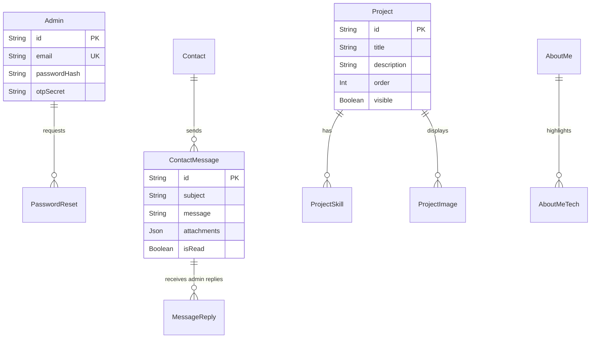

<div align="center">
  <h1>✨ Hëdi OKBA - Premium Developer Portfolio</h1>
  <p><strong>A modern, high-performance web experience coupled with a highly secure Headless CMS</strong></p>
  
  <p>
    <a href="https://nextjs.org"></a>
    <a href="https://react.dev/"></a>
    <a href="https://www.typescriptlang.org"></a>
    <a href="https://tailwindcss.com"></a>
    <a href="https://www.framer.com/motion/"></a>
    <a href="https://www.prisma.io"></a>
  </p>
</div>

<br />

Welcome to the source code of my personal portfolio. This repository is more than just a landing page—it's a showcase of **full-stack engineering, performance optimization, and rigorous security standards**. It features a stunning public-facing UI and a fully functional, highly secured administration dashboard.

---

## 🚀 Value Proposition & Technical Vision

When building this platform, my goal was to demonstrate mastery across the entire modern web stack. This application is structured to deliver:

1. **Uncompromised User Experience (UX):** Leveraging GPU-accelerated micro-animations (`Framer Motion`) and custom glassmorphism architectures.
2. **Robust Security Protocol:** Implementing robust NextAuth protocols, Two-Factor Authentication (TOTP), and enterprise-grade secret management (`Doppler`).
3. **Data Autonomy:** Moving away from third-party CMS platforms to build a bespoke, headless dashboard where I have 100% control over my data, projects, and incoming client messages.

---

## ✨ Key Features

### 🎨 The Public Experience

- **Hardware-Accelerated UI**: Custom rendering architectures designed to bypass standard WebKit/Blink engine compositor glitches, strictly enforcing 60FPS fluid scrolling.
- **Dynamic Content Delivery**: All sections (Biography, Projects, Skills) are fetched dynamically from the PostgreSQL database via highly optimized Next.js server components.
- **Integrated Contact Protocol**: A built-in CRM module. Messages are securely stored in the database and instant notifications are dispatched via React-Email templates.
- **Flawless Responsiveness**: Meticulously crafted design system adapting flawlessly from ultra-wide desktops to mobile viewports with seamless Dark/Light mode toggling.

### 🔐 The Administration Dashboard (CMS)

A bespoke, heavily guarded private workspace accessible only via biometric/2FA verification.

- **Project Overlord**: Complete CRUD capabilities for managing portfolio projects, featuring drag-and-drop Cloudinary media uploads, skill assignments, and live reordering.
- **Client Relations Manager (CRM)**: An integrated inbox to track unread counts, categorize messages, and **reply directly to clients/recruiters** with automated email signatures and Cloudinary attachments.
- **Dynamic CV Injection**: Real-time PDF metadata extraction and live updates of the downloadable resume across the public site.
- **Telemetry & KPIs**: Embedded analytics tracking referrers, traffic origins, operating systems, and message response rates.

---

## 🛠️ Architecture & Tech Stack

### Frontend Engineering

- **React Framework**: [Next.js 16 (App Router)](https://nextjs.org/docs/app) _The Bleeding Edge_
- **Core React library**: [React 19](https://react.dev)
- **Styling Engine**: [Tailwind CSS v4](https://tailwindcss.com) + Vanilla CSS Custom Properties
- **Animation Engine**: [Framer Motion 12](https://www.framer.com/motion/)

### Backend & Infrastructure

- **Architecture Pure Server Components** : Zero REST API. 100% Next.js Server Actions for flawless RPC communication and maximum edge security.
- **Database Engine**: PostgreSQL
- **ORM & Type Safety**: [Prisma 7](https://www.prisma.io/)
- **Authentication**: NextAuth.js (Credentials Provider) + Custom TOTP 2FA Verification
- **Security Protocols**: PostgreSQL-backed Atomic Rate Limiting (in-middleware) protecting auth and contact endpoints against brute-force attacks.
- **Media CDN**: [Cloudinary](https://cloudinary.com/) API Integration
- **Mailing**: Nodemailer alongside `react-email` templates

### Database Architecture

The application features a fully normalized PostgreSQL database managed by Prisma. Below is the Entity-Relationship Diagram representing the core architecture separating the administrative layer from the contact CRM and public-facing content.



### DevOps & Environment

- **Containerization**: Local PostgreSQL instantiation via `Docker Compose`
- **Secrets Management**: [Doppler](https://www.doppler.com/) zero-trust implementation (`npm run pull:env`)

---

## 📸 Gallery & Performance

### Core Web Vitals & Bundle Architecture

This portfolio is strictly engineered to achieve **100/100 across all Lighthouse metrics**: Performance, Accessibility, Best Practices, and SEO.

**Extreme Bundle Optimization**: Heavy JavaScript dependencies (`pdf-lib`, `browser-image-compression`, `recharts`, `@dnd-kit`) are violently stripped from the initial server load using `next/dynamic` (`ssr: false`) and dynamic imports, resulting in an near-instantaneous Client and Dashboard hydration.

### Previews

_(Screenshots coming soon - Add a path to `/public/screenshots/hero.png` here)_

- **Public View**: Glassmorphism Hero Section & Responsive Project Grid
- **Private Dashboard**: 2FA Entry & CRM Message Center

## ⚙️ Local Development Setup

Interested in exploring the architecture? Follow these steps to spin up the environment locally.

### 1. Prerequisites

- [Node.js](https://nodejs.org) (v18+) & NPM/Bun
- [Docker](https://www.docker.com/) (Required for spinning up the local PostgreSQL database instance)
- [Doppler CLI](https://docs.doppler.com/docs/install-cli) (For fetching environment secrets securely)

### 2. Configure Local Secrets

Instead of manually passing `.env` files, this repository utilizes Doppler for enterprise-secret management.

```bash
# Login to Doppler and pull the latest workspace secrets
doppler login
npm run pull:env
```

### 3. Initialize Database Container

Spin up the isolated PostgreSQL database using Docker:

```bash
docker compose up -d
```

Generate the Prisma types and sync the database schema:

```bash
npx prisma generate
npx prisma db push
```

### 4. Ignite the Development Server

```bash
npm run dev
```

Navigate to [http://localhost:3000](http://localhost:3000) to view the application.

---

<div align="center">
  <p><i>By Hëdi OKBA.</i></p>
</div>
